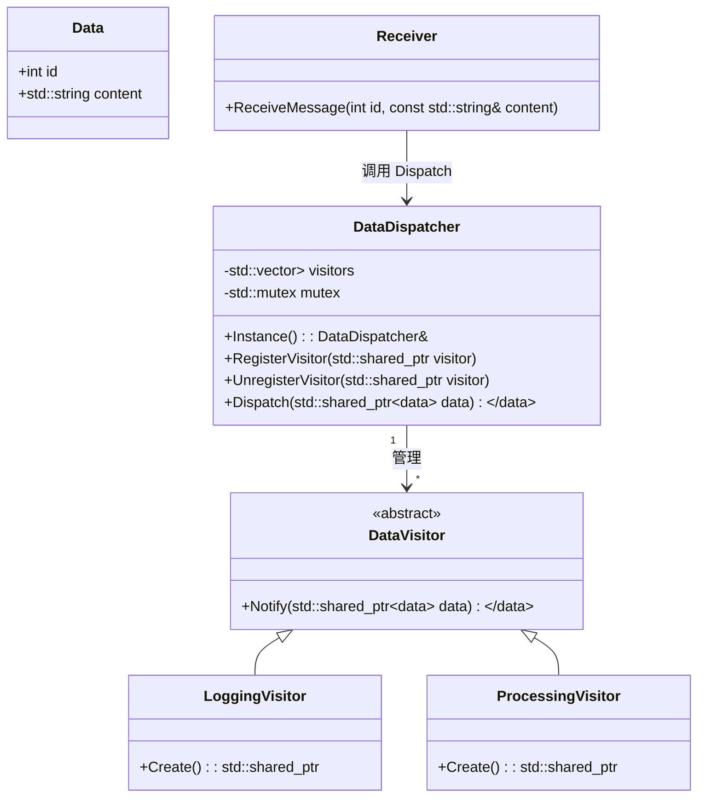

## 0. 引言

使用 C++ 实现一个类似CyberRT 架构的 `DataVisitor` 和 `DataDispatcher`。在 CyberRT 中：

+ **Receiver** 接收到消息后，会触发回调。
+ 回调中调用 **DataDispatcher**（消息分发器）发布消息。
+ **DataDispatcher** 是一个单例，负责所有的数据分发，并将数据放入对应的缓存中。
+ 然后，**DataDispatcher** 会通知对应的协程（在此简化为线程）去处理消息。
+ **DataVisitor**（消息访问器）是辅助类，用于管理数据处理过程，包括注册通知机制和绑定回调函数。

## 1. 设计概要

### 1.1 主要组件

+ **DataDispatcher**：
   - 单例模式。
   - 管理所有 `DataVisitor`。
   - 分发数据到对应的 `DataVisitor` 的缓冲区。
   - 通知 `DataVisitor` 处理数据。

+ **DataVisitor**：
   - 负责特定类型数据的处理。
   - 包含一个线程，等待 `DataDispatcher` 的通知。
   - 绑定一个回调函数用于处理数据。
   - 管理自己的数据缓冲区。

+ **Receiver**：
   - 模拟消息接收器，接收到消息后调用 `DataDispatcher` 发布数据。
###  1.2 类关系图

以下是更新后的类关系图，反映了 `DataDispatcher` 作为单例管理多个 `DataVisitor`，并与 `Receiver` 交互的关系。

### 1.3 工作流程

1. **Receiver** 接收到消息后，调用 `DataDispatcher::Instance()->Dispatch(data)`。
2. **DataDispatcher** 将数据放入对应的 `DataVisitor` 的缓冲区。
3. **DataDispatcher** 通知对应的 `DataVisitor`。
4. **DataVisitor** 的线程被唤醒，取出数据并执行绑定的回调函数进行处理。
